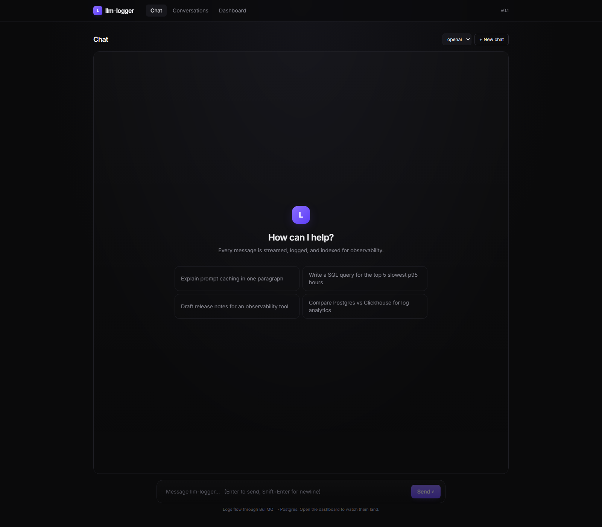
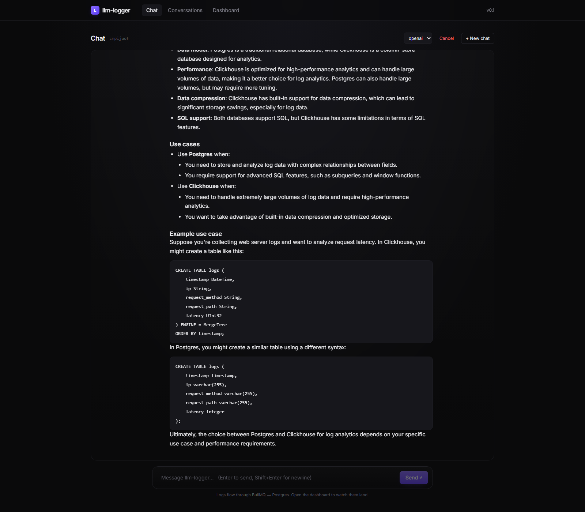
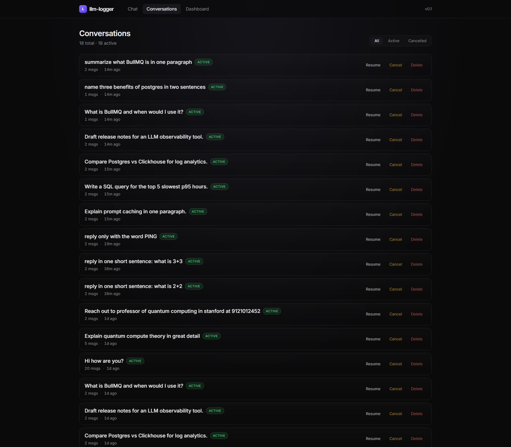
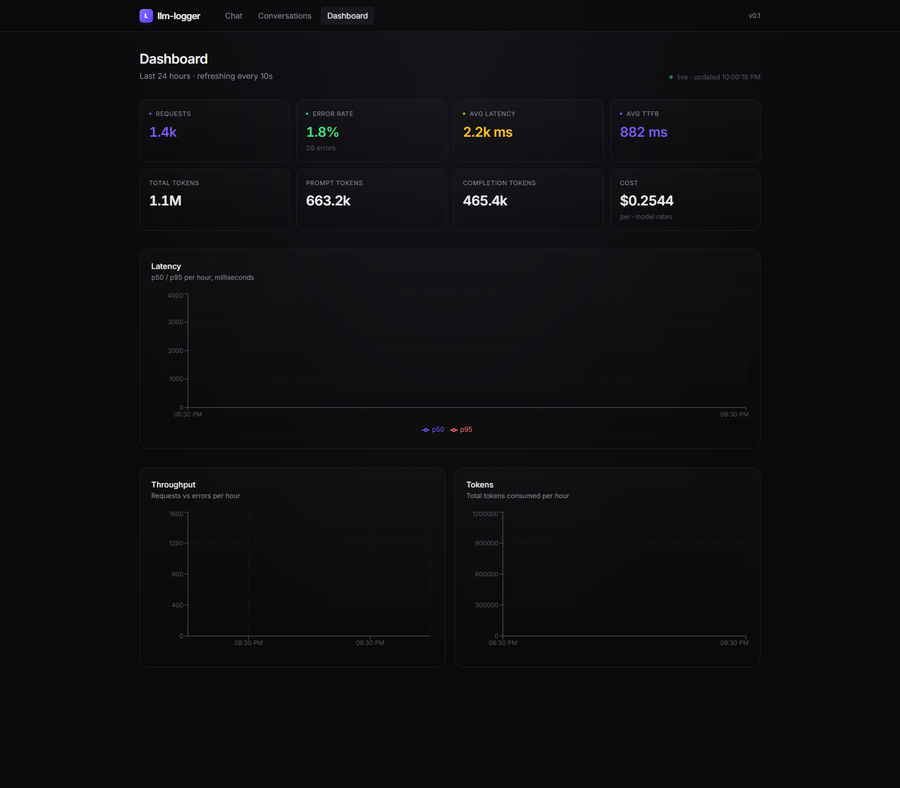

# LLM Logger

A lightweight inference logging and ingestion system for an LLM application: a streaming chatbot, an SDK that captures inference metadata around every model call, an event-driven ingestion pipeline, and a dashboard for latency / throughput / errors.

## Demo

**Live:** https://marry-ooze-ferris.ngrok-free.dev — the local kind cluster exposed via ngrok on a static domain. On first visit you'll see a one-click ngrok interstitial ("Visit Site"). The tunnel runs from a laptop, so if it's offline by the time you read this, the screenshots below show the same app.

**Three logging surfaces side-by-side** — all three feed the same `/api/ingest` → BullMQ → Postgres pipeline and show up on the same dashboard:

| Route | What it demonstrates |
|---|---|
| `POST /api/chat` | Explicit facade (`LLMClient`) — the path the UI uses. |
| `POST /api/auto-chat` | Raw `openai` SDK + `withConversation()`. Patched at boot — zero call-site changes vs. unmodified OpenAI code. |
| `POST /api/custom-chat` | Raw `fetch()` to Groq + `logInference()`. No SDK to patch — works for any custom / internal LLM. |

| Chat (empty) | Chat (multi-turn, markdown) |
|---|---|
|  |  |

| Conversations (list / resume / cancel) | Dashboard (latency, throughput, tokens, cost) |
|---|---|
|  |  |

## Quickstart

```bash
# 1. Set your API key
cp .env.example .env
# edit .env and set OPENAI_API_KEY (or AZURE_OPENAI_* for Azure).
# Optional: also set GROQ_API_KEY to get a second provider in the UI dropdown — free at https://console.groq.com

# 2. Bring everything up
docker compose up --build

# 3. Open the app
open http://localhost:3000
```

That's it. One command brings up Postgres, Redis, the Next.js app, and the ingestion worker. Migrations run on app start.

### Local dev (without Docker)

```bash
docker compose up -d postgres redis     # just the infra
npm install
npx prisma migrate dev
npm run dev                              # Next.js on :3000
npm run worker                           # in another terminal
```

## Architecture overview

```
   ┌────────────┐     stream      ┌──────────────┐    fire-and-forget    ┌──────────────┐
   │  Chat UI   │ ───────────────▶│ /api/chat    │ ─────────────────────▶│ /api/ingest  │
   │ (Next.js)  │◀── tokens ──────│ (Next.js)    │                       │  (Next.js)   │
   └────────────┘                 │  + SDK       │                       └──────┬───────┘
                                  │   wrapper    │                              │ enqueue
                                  └──────┬───────┘                              ▼
                                         │ writes msgs               ┌───────────────────┐
                                         ▼                           │ BullMQ (Redis)    │
                                  ┌────────────┐                     └─────────┬─────────┘
                                  │ Postgres   │◀────── upsert log ────────────┘ worker
                                  └────────────┘
                                         ▲
                                         │ aggregates
                                  ┌────────────┐
                                  │ Dashboard  │
                                  └────────────┘
```

**Flow on one chat turn:**
1. Browser POSTs to `/api/chat`. The route creates/finds the conversation, builds a context window (last 20 messages), and calls the SDK wrapper.
2. The SDK wrapper streams tokens from the configured provider (OpenAI, Azure OpenAI, or Groq) back to the browser **and** measures latency, TTFB, token usage, finish reason.
3. When the stream ends (success, error, or client cancel), the SDK fires a single POST to `/api/ingest` with the inference log. This is fire-and-forget — logging must never block or break the chat.
4. `/api/ingest` validates with Zod and enqueues a job to BullMQ (keyed by `requestId` for dedup).
5. The worker drains the queue and upserts into Postgres. Upsert + dedup key = retries are idempotent.
6. The dashboard queries Postgres aggregates (PERCENTILE_CONT for p50/p95) every 10 seconds.

## Components

| Piece | Where | What it does |
|---|---|---|
| Chat UI | `src/app/page.tsx` | Streaming chat, supports resume via `?id=`, cancel |
| Conversations UI | `src/app/conversations/page.tsx` | List, resume, cancel, delete |
| Dashboard | `src/app/dashboard/page.tsx` | Recharts panels for latency, throughput, errors, tokens |
| SDK wrapper | `src/lib/llm-sdk.ts` | Multi-provider explicit facade, streaming, captures metadata, emits to a `LogSink` |
| Auto-instrumentation | `src/lib/instrument/` | Monkey-patches `OpenAI` + `Anthropic` SDKs at boot; `logInference()` + `registerInstrumentation()` for custom providers |
| Ingest API | `src/app/api/ingest/route.ts` | Zod-validates, enqueues to BullMQ |
| Worker | `src/workers/ingest-worker.ts` | Drains queue, upserts into Postgres |
| Metrics API | `src/app/api/metrics/route.ts` | 24h aggregates with raw SQL percentiles |
| PII redaction | `src/lib/redact.ts` | Regex pass for emails, phones, cards, SSN, PAN, Aadhaar, secrets |

## Schema design decisions

See `prisma/schema.prisma`. Headlines:

- **`Conversation`, `Message`, `InferenceLog` are three separate tables.** A failed inference produces a log but no assistant message. Splitting them lets us run heavy metadata queries (latency p95, error rates) without scanning message text.
- **`InferenceLog.requestId` is unique.** Client-generated UUID, used both as the BullMQ job ID (dedup) and the upsert key in Postgres (idempotency).
- **JSONB `metadata` column** for provider-specific fields (finish reason, raw response bits). Avoids schema churn when providers change response shapes.
- **Indexes match the actual query patterns:** `(status, updatedAt)` for the conversation list, `(createdAt)` and `(provider, model, createdAt)` for the dashboard, `(conversationId, createdAt)` for message ordering.
- **`onDelete: SetNull` from `InferenceLog` → `Conversation`** so deleting a chat doesn't lose the inference metadata (cost analytics survive).
- **`inputPreview` / `outputPreview`** are truncated, PII-redacted copies. Full text lives only in `Message`. Logs stay queryable without putting raw PII in metadata tables.

## Tradeoffs

- **Next.js (TypeScript) over Go/FastAPI.** My primary stack is Go/Java/Python — Next.js wins here because it collapses chat UI + streaming chat API + ingest API + dashboard SSR into one process, which is the smallest credible end-to-end shape for a take-home. Production would split these (Go for the SDK + ingest API, kept as a separate library; React app served independently). See "Components" for the natural split point.
- **BullMQ over Kafka.** Kafka would be the real production choice for an ingestion bus. BullMQ + Redis is the smallest credible event-driven setup — it gets you retries, dedup, dead-letter, and concurrency without standing up Zookeeper/Kraft. Easy to swap later: the worker is just a function.
- **Postgres over Clickhouse/Timescale.** A real metrics workload would use Clickhouse for log volume and aggregation speed. For this scale, Postgres + the right indexes + `PERCENTILE_CONT` is fine and avoids a second datastore.
- **Regex PII redaction.** Will miss anything not on the pattern list. Production would use Microsoft Presidio or a similar entity recognizer. Documented limitation, not a gap I'd ship to prod.
- **Same Next.js app serves UI + chat + ingest.** In production these would be separate services so a noisy ingest endpoint can't degrade chat latency. Mentioned in "what I'd improve."
- **20-message context window.** Hardcoded; should be model-aware (token budget) eventually.
- **No auth.** Out of scope for the take-home; would gate every route behind a session in production.
- **Worker runs in a single process.** Horizontal scaling needs a separate deployment; the code is ready (concurrency: 8, stateless), the topology isn't.

## What I'd improve with more time

1. **Split services.** Chat app, ingest API, and worker as separate deployments. Move ingest behind a load balancer with its own autoscaling profile.
2. **Real event bus.** Kafka or Redpanda with a schema registry. Lets multiple consumers (analytics warehouse, alerting, fine-tune dataset builder) tap the same stream.
3. **Move logs to Clickhouse.** Keep `Conversation` and `Message` in Postgres; ship `InferenceLog` to Clickhouse for cheap aggregations at scale.
4. **PII redaction with Presidio** (or a small classifier) instead of regex. Add a per-org allowlist of "this is OK to log."
5. **Auth + multi-tenancy.** `OrgId` on every row, RLS in Postgres, API keys for the SDK so external apps can ship logs.
6. **Cost tracking.** Multiply tokens by a per-model price table; surface $/conversation, $/user, $/model.
7. **Tracing.** OpenTelemetry spans around every LLM call. Send to Tempo/Jaeger; correlate dashboard metrics with trace IDs.
8. **Anthropic + Gemini adapters.** Interface is already there; ~30 lines each.
9. **Tests.** Vitest for the SDK wrapper (the part most worth pinning down) + a Playwright happy-path for the chat UI.
10. **k8s deploy.** Helm chart with separate deployments for `web`, `worker`, `postgres`, `redis`, HPA on the worker.

## Performance

Real load test against `/api/ingest` on the local kind cluster — single `web` replica, single `worker` replica, single-node Postgres + Redis, all on one laptop. Run via `npm run loadtest` (`scripts/loadtest.mjs`, uses [autocannon](https://github.com/mcollina/autocannon)).

```
target:   http://host.docker.internal:3000/api/ingest
duration: 30 s
connections: 50

requests:    3093   (103 req/s sustained)
latency:     p50 = 396 ms   p95 = 911 ms   p99 = 3116 ms   max = 9648 ms
non-2xx:     0
errors:      0
timeouts:    0
```

The full round-trip is exercised — each request goes through Zod validation, BullMQ enqueue, the Redis hop, the worker dequeue, the per-model cost calculation, and the Postgres upsert. No mocks. After the run, `/api/metrics` reported 4,042 rows in `InferenceLog` for the 24h window with the expected per-model cost totals.

The bottleneck at this scale is the worker → Postgres write loop (concurrency 8). Horizontally scaling `worker` is the natural lever; the Deployment is stateless and `requestId`-keyed upserts make retries idempotent.

## Auto-instrumentation (monkey patch)

The SDK ships in two shapes — the explicit facade (`LLMClient` in `src/lib/llm-sdk.ts`) that `/api/chat` uses for the streaming UI, and an **auto-instrumentation layer** that monkey-patches the provider SDKs at boot. With auto-instrumentation, calling the raw `openai` SDK is enough — every `client.chat.completions.create(...)` gets latency / TTFB / token / cost / error metadata logged with zero call-site changes.

```ts
import OpenAI from "openai";
import {
  installAutoInstrumentation,
  withConversation,
} from "@/lib/instrument";

installAutoInstrumentation(); // once per process

const openai = new OpenAI({ apiKey: process.env.OPENAI_API_KEY });

// Calls inside this block get logged with the given conversationId.
await withConversation("conv_123", async () => {
  const stream = await openai.chat.completions.create({
    model: "gpt-4o-mini",
    messages: [{ role: "user", content: "hello" }],
    stream: true,
  });
  for await (const chunk of stream) process.stdout.write(chunk.choices[0]?.delta?.content ?? "");
});
```

**Shape.** A small framework (`src/lib/instrument/core.ts`) handles timing, error capture, AsyncLocalStorage-based conversation propagation, and log emission. Each provider gets a small adapter that fills in four shape-specific things — which method to patch, how to read the request, how to walk the response, how to walk the stream. **OpenAI** and **Anthropic** adapters ship today (`src/lib/instrument/openai.ts`, `src/lib/instrument/anthropic.ts`); the OpenAI adapter automatically covers Azure OpenAI, Groq, OpenRouter, Together, Fireworks, vLLM, Ollama — any provider that speaks the OpenAI wire format. A new provider is a ~40-LOC adapter.

**Streaming is supported.** The patch wraps the async iterator returned by `create({ stream: true })` and force-enables `stream_options.include_usage` so token counts arrive in the final chunk. The Anthropic adapter walks `content_block_delta` + `message_delta` events for the same coverage.

**Demo route.** `POST /api/auto-chat` exercises the auto-instrumented path — the route uses the raw `openai` SDK directly (no facade) and only wraps the call in `withConversation`. Compare with `POST /api/chat`, which uses the explicit facade. Both feed the same `/api/ingest` -> BullMQ -> Postgres pipeline.

**Why monkey-patch instead of a facade?** Real apps have dozens of LLM call sites scattered across services. A facade-based logger means refactoring every call site to go through *our* SDK. A monkey patch means `installAutoInstrumentation()` once at boot and every existing `openai.chat.completions.create(...)` gets logged — zero call-site changes for the entire codebase.

### Adding a custom provider

The OpenAI + Anthropic adapters cover most providers (anyone OpenAI-compatible is free; Anthropic proves the framework handles a genuinely different SDK). Three extension points for everything else:

**1. OpenAI-compatible custom endpoint** — point the OpenAI SDK at a different `baseURL`. No new code:
```ts
const internal = new OpenAI({ apiKey: "...", baseURL: "https://llm.internal/openai/v1" });
await internal.chat.completions.create({ model: "internal-7b", messages: [...] });
// already instrumented because `OpenAI.Chat.Completions.prototype.create` is patched.
```

**2. Custom SDK that's a JS class** — write a ~40-LOC adapter and register it:
```ts
import { patchMethod, registerInstrumentation } from "@/lib/instrument";
import MyProviderSDK from "@my-org/llm-sdk";

registerInstrumentation(() => {
  patchMethod({
    target: MyProviderSDK.Completions,
    method: "create",
    provider: "my-org",
    extractRequest: (args) => ({ provider: "my-org", model: args[0].model, inputText: ..., stream: !!args[0].stream }),
    handleNonStreaming: (resp) => ({ outputText: resp.text, usage: { prompt: resp.usage.in, completion: resp.usage.out, total: resp.usage.total } }),
    handleStreaming: () => ({ parse: (chunk) => ({ text: chunk.delta }) }),
  });
  return true;
});
```

**3. No SDK at all (raw HTTP / gRPC / bespoke wire)** — wrap the call with `logInference`:
```ts
import { logInference, withConversation } from "@/lib/instrument";

await withConversation("conv_123", () =>
  logInference(
    { provider: "internal-vllm", model: "qwen-72b", inputText: prompt },
    async (record) => {
      const resp = await fetch("https://vllm.internal/generate", { method: "POST", body: ... });
      const data = await resp.json();
      record.usage({ prompt: data.prompt_tokens, completion: data.completion_tokens, total: data.total_tokens });
      record.finish(data.finish_reason);
      return data.text;
    }
  )
);
```

`/api/auto-chat` is the live demo of path #1 (raw `openai` SDK, patched at boot). `/api/custom-chat` is the live demo of path #3 (raw `fetch()` to Groq, instrumented manually with `logInference`). Both feed the same `/api/ingest` → BullMQ → Postgres pipeline alongside the explicit-facade route at `/api/chat`.

**Why not just OpenTelemetry GenAI spans?** Deliberate scope choice — keeping the custom schema lets the same pipeline serve the existing dashboard without an OTel collector in the deployment. The patch framework is shaped so an OTel exporter would slot in beside `QueueLogSink` (it's an injectable `LogSink`).

## Reliability features

- **Per-IP rate limit on `/api/chat`** — Redis fixed-window via `INCR`+`PEXPIRE`. Defaults to 30 req/min/IP (`CHAT_RATE_LIMIT_PER_MIN`). Returns `429` with `Retry-After`. See `src/lib/rate-limit.ts`.
- **Per-conversation token budget cap** — sums `totalTokens` across successful logs for a conversation and refuses further turns over the cap (`CONVERSATION_TOKEN_CAP`, default 200k). Stops runaway loops and accidental cost spikes.
- **Circuit breaker on provider calls** — per-process, per-provider. Five consecutive failures open the breaker; 30 s cooldown, then a probe. Implementation in `src/lib/circuit-breaker.ts`. User-initiated `AbortError` and `cancelled` outcomes are not counted as upstream failures.
- **Real per-model cost** — `src/lib/pricing.ts` is the rate table; the worker computes `costUsd` at ingest time and stores it on `InferenceLog`. The dashboard sums `costUsd` directly (no hardcoded blended rates).

## Bonus checklist

- [x] Multi-provider support — `ProviderAdapter` interface with OpenAI (incl. Azure) and Groq implemented; UI exposes a per-message provider selector when more than one is configured. Anthropic is a drop-in.
- [x] Agnostic / drop-in inference logging — `installAutoInstrumentation()` monkey-patches the `openai` and `@anthropic-ai/sdk` SDKs at boot. Callers using the raw SDKs get logging for free, no facade in the call site. Custom / internal LLMs without an SDK use `logInference()`; SDKs we don't ship adapters for register via `patchMethod()` + `registerInstrumentation()`. See "Auto-instrumentation" above.
- [x] Streaming responses — end-to-end via `ReadableStream` and OpenAI's stream.
- [x] Latency + throughput + errors dashboards — Recharts, refreshes every 10s.
- [x] Docker Compose one-command setup — `docker compose up --build`.
- [x] Event-based architecture — BullMQ + Redis between ingest API and DB writer.
- [x] PII redaction — regex pass before `inputPreview` / `outputPreview` are persisted.
- [x] Cancel conversation — UI button + `PATCH /api/conversations/:id`.
- [x] List conversations — `/conversations` page.
- [x] Resume a conversation — `/?id=<conversationId>`.
- [x] k8s deploy — raw manifests under `k8s/` (Namespace, ConfigMap, Secret, Postgres StatefulSet, Redis StatefulSet, migrate Job, web Deployment + NodePort Service, worker Deployment). Verified end-to-end on a local `kind` cluster.

## Deploy on Kubernetes (kind)

Raw manifests live in `k8s/`. The flow below brings the whole stack up on a local [kind](https://kind.sigs.k8s.io/) cluster — same containers as `docker compose`, just orchestrated by k8s.

```bash
# 1. Build the images locally
docker compose build app worker

# 2. Create a kind cluster that maps NodePort 30000 -> host 3000
kind create cluster --config k8s/kind-cluster.yaml

# 3. Load local images into the cluster (no registry needed)
kind load docker-image llm-logger-app:latest llm-logger-worker:latest --name llm-logger

# 4. Namespace + ConfigMap
kubectl apply -f k8s/namespace.yaml -f k8s/configmap.yaml

# 5. Secrets — supply your provider keys. Either copy the example and edit:
cp k8s/secret.example.yaml k8s/secret.yaml      # k8s/secret.yaml is gitignored
kubectl apply -f k8s/secret.yaml
# ...or create directly:
kubectl -n llm-logger create secret generic app-secrets \
  --from-literal=OPENAI_API_KEY=sk-... \
  --from-literal=GROQ_API_KEY=gsk_...

# 6. Datastores, schema migration, and the app
kubectl apply -f k8s/postgres.yaml -f k8s/redis.yaml
kubectl apply -f k8s/migrate-job.yaml
kubectl apply -f k8s/web.yaml -f k8s/worker.yaml

# 7. Open the app
open http://localhost:3000
```

Topology — `web` and `worker` are separate Deployments so they scale independently. Postgres and Redis are StatefulSets with PVCs (1 replica each; dev-grade). The `prisma-migrate` Job waits for Postgres via an init container, then runs `prisma migrate deploy` once per install.

## Project layout

```
src/
  app/
    page.tsx                          # Chat UI
    conversations/page.tsx            # List / resume / cancel
    dashboard/page.tsx                # Charts
    api/
      chat/route.ts                   # Streaming chat endpoint
      ingest/route.ts                 # Log ingestion (validates + enqueues)
      conversations/route.ts          # List
      conversations/[id]/route.ts     # Get / PATCH (cancel) / DELETE
      metrics/route.ts                # Dashboard aggregates
  lib/
    llm-sdk.ts                        # The SDK wrapper
    prisma.ts                         # Prisma client singleton
    queue.ts                          # BullMQ producer
    redact.ts                         # PII redaction
    schemas.ts                        # Zod validation
  workers/
    ingest-worker.ts                  # Queue consumer
prisma/
  schema.prisma
docker-compose.yml
Dockerfile
```
